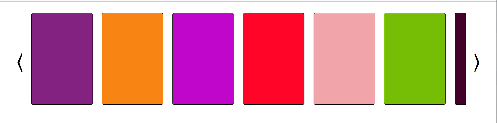
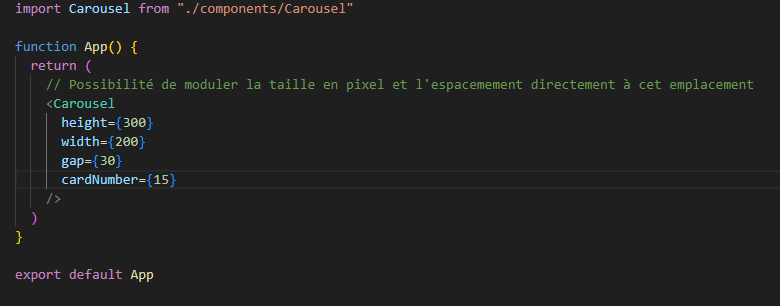

# Composant de Carousel React + TypeScript adaptable, configurable et surchargeable
`Visualistion du carousel :`

# https://composant-carousel-react.vercel.app

## Installation

`npm install`

`npm run dev`

## Composant principal

`src/Carousel`

`configurable directement dès son appel dans App ou toute page dédiée.`

```Pour pouvoir distinguer les différentes cards, j'ai généré les couleurs dynamiquement pour alimenter le background-color des cards.```



```Possibilité de gérer la hauteur et largeur en pixel des cards ainsi que l'espacement et le nombre de cards via les props du composant principal.```



```Exemple après implémentation sur un site. Le carousel est customisable facilement. Possibilité de mettre le résultat de l'appel API dans generateColor. Attention à changer le typage.```


